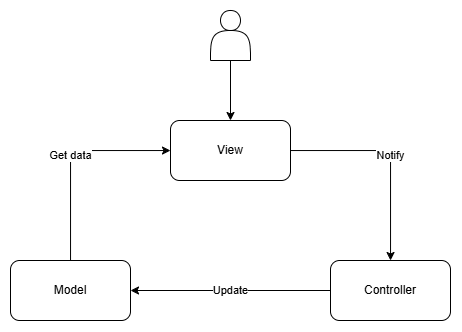

# **AXitMVC**

AXitMVC is a library designed to support the MVC (Model-View-Controller) pattern in Unity, enabling a clear separation of logic, data, and user interface components. Unlike other MVC libraries, AXitMVC provides specific support for MonoBehaviour-based classes, making it highly compatible with Unity's workflow.

# **Installation**

1. Open Unity and go to **Package Manager** via **Windows > Package Manager**.
2. Click on the **Plus (+)** icon > **Add Package from git URL**.
3. Paste the following link in the URL field: `https://github.com/ngocphat03/AXitMVC.git`
4. Click **Add** to install the package into your project.

# Understanding the Concepts

AXitMVC facilitates MVC implementation in Unity with an approach that optimizes for MonoBehaviour. Rather than combining data, logic, and UI in a single class, this library helps divide them into distinct components based on the MVC model, promoting code readability and maintainability.

<p align="center">
  
</p>

## Model

The Model is responsible for storing and managing application data. All state data or persistent information resides within Model classes. Models do not interact directly with UI components but instead rely on Controllers to notify the View when updates occur.

## Controller

The Controller serves as an intermediary, receiving events from the View and handling calculations or data processing within the Model. Once processing is complete, the Controller then updates the corresponding states in the View.

## View

The View is responsible for presenting the interface and handling user interactions. It captures user input, notifies the Controller of triggered events, and responds to users after receiving updated information from the Model through the Controller.

# Usage Guide

This section provides a step-by-step guide to using AXitMVC in Unity to set up and connect your Models, Views, and Controllers. For a full working example, refer to the [sample project on GitHub](https://github.com/ngocphat03/AXitMVC/tree/release/Sample).

## 1. **Create the Model**

First, define a class that implements the `IModel` interface. This class will store data and provide methods for managing this data.

```csharp
using AXitUnityTemplate.MVC.Interface;

public class PlayerModel : IModel
{
    public int Score { get; set; }
    public string PlayerName { get; set; }
}
```

## 2. **Create the Controller**

Next, create a Controller class that implements `IController<TModel>`, where `TModel` is the Model type you created. This Controller will handle updates to the Model and notify the View when changes occur.

```csharp
using AXitUnityTemplate.MVC.Interface;

public class PlayerController : IController<PlayerModel>
{
    public PlayerModel Model { get; set; }

    public void UpdateScore(int newScore)
    {
        Model.Score = newScore;
        // Additional logic to notify the View about the updated score
    }
}
```

## 3. **Create the View**

Then, create a View class that inherits from `BaseView<TModel, TController>`. This View class will handle user interactions and communicate with the Controller.

```csharp
using AXitUnityTemplate.MVC.Base;

public class PlayerView : BaseView<PlayerModel, PlayerController>
{
    protected override void Init()
    {
        // Initialization code specific to the view
        Debug.Log("PlayerView initialized.");
    }

    public void OnScoreButtonClicked()
    {
        Controller.UpdateScore(Model.Score + 1);
        Debug.Log($"Score updated to: {Model.Score}");
    }
}
```

## 4. **Assign View in Unity**

1. Attach the `PlayerView` script to a GameObject in the Unity scene.
2. In the **Inspector**, the `PlayerView` will automatically instantiate its `Controller` and `Model` due to the `Awake()` method in `BaseView`.

## 5. **Test the Setup**

Once your Model, Controller, and View are set up, you can add logic to test their interaction in Unity.

- For example, you could call `OnScoreButtonClicked()` from a button click event in Unity's UI system to verify that pressing the button correctly updates the score.

# Note on Initialization

In AXitMVC, the `Init()` method is designed as an alternative to the standard `Awake()` method for initializing components. This distinction is important because `Awake()` in the `BaseView` class automatically sets up the `Controller` and `Model` instances for the View. However, any further setup or specific initialization logic should be handled in the `Init()` method within your View classes.